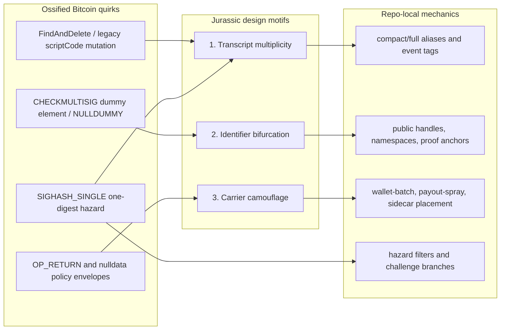
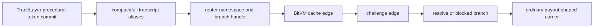
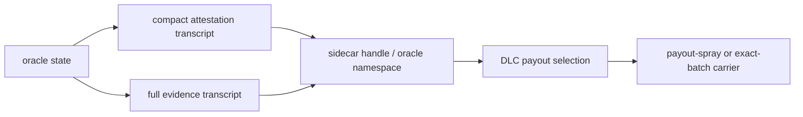
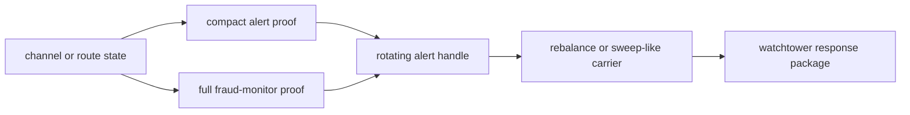
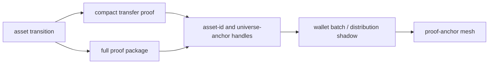
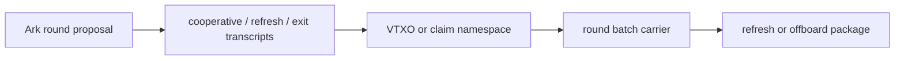
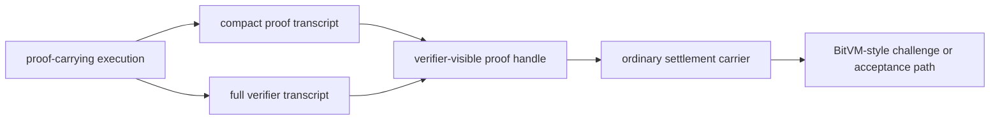

# Bitcoin DeFi Graft Diagrams

This note explains how the current repo demos turn three Jurassic Bitcoin motifs into reusable Bitcoin DeFi mechanics. The demos do not rely on rebroadcasting obsolete or policy-rejected transactions. They use ossified consensus and policy surfaces as design fossils, then re-express them as deterministic overlay fields, relay blobs, namespace handles, carrier hints, and procedural-token state transitions.

## Motif Map



Relevant Bitcoin Core fossil anchors:

| motif | Bitcoin Core anchors |
| --- | --- |
| Transcript multiplicity | [v30.0 FindAndDelete](https://github.com/bitcoin/bitcoin/blob/v30.0/src/script/interpreter.cpp#L228-L236), [v30.0 CHECKSIG FindAndDelete call](https://github.com/bitcoin/bitcoin/blob/v30.0/src/script/interpreter.cpp#L325-L331), [v30.0 CHECKMULTISIG FindAndDelete call](https://github.com/bitcoin/bitcoin/blob/v30.0/src/script/interpreter.cpp#L1142-L1148), [v30.0 SIGHASH_SINGLE one digest](https://github.com/bitcoin/bitcoin/blob/v30.0/src/script/interpreter.cpp#L1599-L1605), [v0.12.0 CHECKSIG scriptCode mutation](https://github.com/bitcoin/bitcoin/blob/v0.12.0/src/script/interpreter.cpp#L831-L835), [v0.12.0 CHECKMULTISIG scriptCode mutation](https://github.com/bitcoin/bitcoin/blob/v0.12.0/src/script/interpreter.cpp#L887-L891), [v0.12.0 SIGHASH_SINGLE one digest](https://github.com/bitcoin/bitcoin/blob/v0.12.0/src/script/interpreter.cpp#L1080-L1085) |
| Identifier bifurcation | [v30.0 NULLDUMMY check](https://github.com/bitcoin/bitcoin/blob/v30.0/src/script/interpreter.cpp#L1197-L1202), [v0.12.0 NULLDUMMY check](https://github.com/bitcoin/bitcoin/blob/v0.12.0/src/script/interpreter.cpp#L932-L939), [v30.0 CHECKMULTISIG FindAndDelete call](https://github.com/bitcoin/bitcoin/blob/v30.0/src/script/interpreter.cpp#L1142-L1148), [v0.12.0 CHECKMULTISIG scriptCode mutation](https://github.com/bitcoin/bitcoin/blob/v0.12.0/src/script/interpreter.cpp#L887-L891) |
| Carrier camouflage | [v30.0 OP_RETURN script failure](https://github.com/bitcoin/bitcoin/blob/v30.0/src/script/interpreter.cpp#L666-L668), [v0.12.0 OP_RETURN script failure](https://github.com/bitcoin/bitcoin/blob/v0.12.0/src/script/interpreter.cpp#L433-L435), [v30.0 nulldata datacarrier policy](https://github.com/bitcoin/bitcoin/blob/v30.0/src/policy/policy.cpp#L136-L150), [v30.0 standard transaction policy entry](https://github.com/bitcoin/bitcoin/blob/v30.0/src/policy/policy.cpp#L99-L105) |

## Demo 1: BitVM Router Dispute



How the quirks are used:

| motif | demo mechanic |
| --- | --- |
| Transcript multiplicity | `FindAndDelete` and `SIGHASH_SINGLE` become compact/full transcript variants and hazard-filter branches for the dispute graph. |
| Identifier bifurcation | The router branch id is separated from the proof/transcript id, mirroring the dummy-element axis without depending on an invalid dummy. |
| Carrier camouflage | The published state is shaped like a normal payout or sidecar batch rather than a custom protocol announcement. |

Bitcoin Core anchors: [FindAndDelete](https://github.com/bitcoin/bitcoin/blob/v30.0/src/script/interpreter.cpp#L228-L236), [CHECKSIG scriptCode path](https://github.com/bitcoin/bitcoin/blob/v30.0/src/script/interpreter.cpp#L325-L331), [CHECKMULTISIG scriptCode path](https://github.com/bitcoin/bitcoin/blob/v30.0/src/script/interpreter.cpp#L1142-L1148), [SIGHASH_SINGLE one digest](https://github.com/bitcoin/bitcoin/blob/v30.0/src/script/interpreter.cpp#L1599-L1605), [NULLDUMMY](https://github.com/bitcoin/bitcoin/blob/v30.0/src/script/interpreter.cpp#L1197-L1202), [datacarrier policy](https://github.com/bitcoin/bitcoin/blob/v30.0/src/policy/policy.cpp#L136-L150).

## Demo 2: DLC Oracle Sidecar



How the quirks are used:

| motif | demo mechanic |
| --- | --- |
| Transcript multiplicity | One oracle fact can be packaged as compact and full transcripts, similar to multiple historical scriptCode views. |
| Identifier bifurcation | The oracle event id, sidecar blob reference, and DLC reference are separate handles for the same economic state. |
| Carrier camouflage | Oracle publication is hidden inside payout-like or exact-batch traffic instead of a unique-looking oracle transaction. |

Bitcoin Core anchors: [FindAndDelete](https://github.com/bitcoin/bitcoin/blob/v30.0/src/script/interpreter.cpp#L228-L236), [CHECKSIG scriptCode path](https://github.com/bitcoin/bitcoin/blob/v30.0/src/script/interpreter.cpp#L325-L331), [SIGHASH_SINGLE one digest](https://github.com/bitcoin/bitcoin/blob/v30.0/src/script/interpreter.cpp#L1599-L1605), [OP_RETURN](https://github.com/bitcoin/bitcoin/blob/v30.0/src/script/interpreter.cpp#L666-L668), [datacarrier policy](https://github.com/bitcoin/bitcoin/blob/v30.0/src/policy/policy.cpp#L136-L150).

## Demo 3: Lightning Watchtower Beacon



How the quirks are used:

| motif | demo mechanic |
| --- | --- |
| Transcript multiplicity | Watchtower alerts have compact and full proof encodings over the same monitored state. |
| Identifier bifurcation | Alert handles rotate independently from the monitored channel state and the proof payload. |
| Carrier camouflage | Publication cadence is shaped to resemble rebalances, sweeps, or ordinary maintenance batches. |

Bitcoin Core anchors: [FindAndDelete](https://github.com/bitcoin/bitcoin/blob/v30.0/src/script/interpreter.cpp#L228-L236), [CHECKSIG scriptCode path](https://github.com/bitcoin/bitcoin/blob/v30.0/src/script/interpreter.cpp#L325-L331), [NULLDUMMY](https://github.com/bitcoin/bitcoin/blob/v30.0/src/script/interpreter.cpp#L1197-L1202), [datacarrier policy](https://github.com/bitcoin/bitcoin/blob/v30.0/src/policy/policy.cpp#L136-L150).

## Demo 4: Taproot Assets Anchor Mesh



How the quirks are used:

| motif | demo mechanic |
| --- | --- |
| Transcript multiplicity | Asset transition proof material is split into compact and full transcript packages. |
| Identifier bifurcation | The asset id, universe anchor, and local proof anchor can be separate names for one transition. |
| Carrier camouflage | The anchor is published under wallet-batch or distribution-shadow hints rather than a one-off proof beacon. |

Bitcoin Core anchors: [FindAndDelete](https://github.com/bitcoin/bitcoin/blob/v30.0/src/script/interpreter.cpp#L228-L236), [NULLDUMMY](https://github.com/bitcoin/bitcoin/blob/v30.0/src/script/interpreter.cpp#L1197-L1202), [OP_RETURN](https://github.com/bitcoin/bitcoin/blob/v30.0/src/script/interpreter.cpp#L666-L668), [datacarrier policy](https://github.com/bitcoin/bitcoin/blob/v30.0/src/policy/policy.cpp#L136-L150).

## Demo 5: Ark Batch Liquidity



How the quirks are used:

| motif | demo mechanic |
| --- | --- |
| Transcript multiplicity | Cooperative round, refresh, and exit paths become alternate transcripts over a related liquidity event. |
| Identifier bifurcation | VTXO, claim, and round identifiers are explicit namespace handles rather than one overloaded id. |
| Carrier camouflage | Round batches provide natural cover for proof and liquidity metadata. |

Bitcoin Core anchors: [CHECKMULTISIG scriptCode path](https://github.com/bitcoin/bitcoin/blob/v30.0/src/script/interpreter.cpp#L1142-L1148), [NULLDUMMY](https://github.com/bitcoin/bitcoin/blob/v30.0/src/script/interpreter.cpp#L1197-L1202), [standard transaction policy](https://github.com/bitcoin/bitcoin/blob/v30.0/src/policy/policy.cpp#L99-L105), [datacarrier policy](https://github.com/bitcoin/bitcoin/blob/v30.0/src/policy/policy.cpp#L136-L150).

## Demo 6: Shinigami-Style Proof Execution



How the quirks are used:

| motif | demo mechanic |
| --- | --- |
| Transcript multiplicity | Proof execution has compact and full verification transcripts, plus hazard-filter branches. |
| Identifier bifurcation | The public proof handle, local proof package, and settlement reference remain distinct. |
| Carrier camouflage | Proof material is committed through ordinary settlement or nulldata-shaped publication envelopes. |

Bitcoin Core anchors: [FindAndDelete](https://github.com/bitcoin/bitcoin/blob/v30.0/src/script/interpreter.cpp#L228-L236), [CHECKSIG scriptCode path](https://github.com/bitcoin/bitcoin/blob/v30.0/src/script/interpreter.cpp#L325-L331), [SIGHASH_SINGLE one digest](https://github.com/bitcoin/bitcoin/blob/v30.0/src/script/interpreter.cpp#L1599-L1605), [OP_RETURN](https://github.com/bitcoin/bitcoin/blob/v30.0/src/script/interpreter.cpp#L666-L668), [datacarrier policy](https://github.com/bitcoin/bitcoin/blob/v30.0/src/policy/policy.cpp#L136-L150).

## Repository Entry Points

The deterministic source of the dashboard graft data is `scripts/build_bitcoin_defi_graft_map.py`. Current live or repo-local mesh entrypoints are referenced in `artifacts/grants/bitcoin_defi_graft_map.json` after running:

```powershell
python .\scripts\build_bitcoin_defi_graft_map.py
```

The Vite dashboard copies that artifact into `tools/quirk-museum-vite/public/bitcoin-defi-graft-map.json` during:

```powershell
npm --prefix .\tools\quirk-museum-vite run build
```
