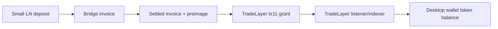

# LN Deposit To TradeLayer LNBTC

This is the minimum build path for testing a small Lightning deposit that ends as
wallet-visible tokenized BTC in the TradeLayer desktop wallet.

Use LTCTEST or a local test harness first. Do not start with mainnet BTC. The
desktop-wallet proof we need is simple: after the Lightning invoice settles, the
same wallet address must show a positive TradeLayer token balance via
`tl_getAllBalancesForAddress`.

## Target Result



The bridge mints/grants a managed TradeLayer property, tentatively `LNBTC`, only
after it verifies a settled Lightning invoice. The desktop wallet does not need
fake balances or a special UI for the first test; it already polls token balances
for each wallet address.

## Existing Pieces

- `C:\projects\TLWallet\tradelayer-wallet` runs the Electron desktop wallet and
  wallet-server.
- `C:\projects\tradelayer.js\src\walletListener.js` exposes the protocol REST
  surface at `http://127.0.0.1:3000`.
- `C:\projects\tradelayer.js\src\txUtils.js` already has managed-token issue and
  grant helpers:
  - `issuePropertyTransaction(...)` for `tx1`
  - `createGrantManagedTokenTransaction(...)` for `tx11`
- `C:\projects\TLWallet\tradelayer-wallet\packages\wallet-fe\src\app\@core\services\balance.service.ts`
  displays tokens from `tl_getAllBalancesForAddress`.
- `C:\projects\UTXORef\UTXO-Ref\bitvm3\utxo_referee\utxoref_dlc_subswap_funding.js`
  already models the LN/subswap/DLC-side funding evidence shape.

## One-Time Token Setup

Create one managed TradeLayer property for wrapped Lightning BTC deposits:

```text
ticker: LNBTC
type: managed
admin: funded bridge/admin address
decimals: 8 by convention
unit mapping: 1 sat deposited = 0.00000001 LNBTC granted
```

The issuing transaction is TradeLayer `tx1`. Record the resulting `propertyId`
in a small bridge config file, for example:

```json
{
  "network": "LTCTEST",
  "propertyId": 381,
  "ticker": "LNBTC",
  "adminAddress": "tltc1...",
  "listenerUrl": "http://127.0.0.1:3000"
}
```

## Bridge Flow

1. Desktop wallet provides a destination TradeLayer address.
2. Bridge creates a Lightning invoice for a small amount, for example `1000`
   sats.
3. User pays invoice from a test LN wallet.
4. Bridge verifies the invoice is settled and stores:
   - payment hash
   - preimage hash
   - amount in sats
   - destination TradeLayer address
   - invoice creation and settlement timestamps
5. Bridge broadcasts `tx11` grant for `amountSats / 100000000` LNBTC to the
   destination address.
6. TradeLayer listener indexes the grant.
7. Desktop wallet refreshes balances and shows `token_<propertyId>` with the
   granted amount.

The grant should bind the LN receipt into procedural metadata where available:

```json
{
  "propertyId": 381,
  "amountGranted": 0.00001,
  "addressToGrantTo": "tltc1...",
  "dlcHash": "<paymentHash>",
  "dlcTemplateId": "lnbtc-deposit-v1",
  "dlcContractId": "<invoiceId-or-requestId>",
  "settlementState": "PAID"
}
```

## Local Startup

Start the desktop wallet and let it manage the LTCTEST node when possible:

```powershell
cd C:\projects\TLWallet\tradelayer-wallet
npm start
```

In the desktop wallet:

```text
Network: Litecoin Testnet
Data dir: D:\testnetwallet
API URL: http://127.0.0.1:3000
```

Start the TradeLayer listener:

```powershell
cd C:\projects\tradelayer.js
node src\walletListener.js
```

Sanity checks:

```powershell
Invoke-WebRequest "http://127.0.0.1:3000/tl_getSyncStatus" -Method Post -ContentType "application/json" -Body "{}" -UseBasicParsing
Invoke-WebRequest "http://127.0.0.1:1986/api/bitvm/watchtower/status" -UseBasicParsing
```

## Bridge API To Build

The first bridge can live in UTXORef or the Jurassic repo, but it should call the
real TradeLayer listener/runtime.

```text
POST /v1/lnbtc/deposit-quote
body: { "destinationAddress": "tltc1...", "amountSats": 1000 }
returns: { "invoice": "...", "paymentHash": "...", "requestId": "..." }

POST /v1/lnbtc/finalize
body: { "requestId": "...", "paymentHash": "..." }
effect: verify invoice settled, broadcast tx11 grant
returns: { "grantTxid": "...", "propertyId": 381, "amount": 0.00001 }

GET /v1/lnbtc/deposits/:requestId
returns: bridge receipt, invoice state, grant state, wallet-facing amount
```

For the first deterministic pass, the LN adapter can be `mock-settled` and the
TradeLayer adapter can be `dry-run`. The live acceptance test must switch both
to real adapters.

## Acceptance Test

A successful end-to-end run must record:

- invoice/payment hash
- settled amount in sats
- destination wallet address
- `tx11` grant txid
- `propertyId`
- `tl_getAllBalancesForAddress` response showing available LNBTC
- desktop wallet screenshot or capture showing the same token balance

The decisive check is this listener call:

```powershell
$addr = "tltc1..."
Invoke-WebRequest "http://127.0.0.1:3000/tl_getAllBalancesForAddress" `
  -Method Post `
  -ContentType "application/json" `
  -Body (@{ params = $addr } | ConvertTo-Json) `
  -UseBasicParsing
```

If that returns the property balance, the desktop wallet should show it on the
next balance refresh because it consumes the same endpoint.

## Jurassic Motif Mapping

- Transcript multiplicity: the same deposit can carry a wallet invoice receipt,
  a bridge receipt, and a tx11 grant transcript, all binding the same payment
  hash.
- Identifier bifurcation: the public invoice id/request id can differ from the
  TradeLayer `dlcContractId` and wallet-visible property id while the committed
  payment hash remains fixed.
- Carrier camouflage: the final on-chain action is an ordinary managed-token
  grant transaction, not a bespoke exotic Bitcoin transaction shape.

## Mainnet Readiness Gate

Do not move this to real BTC/LN value until these are true:

- the LNBTC property admin key is isolated from the desktop test wallet;
- invoice settlement is verified directly against LND/CLN, not trusted from a
  callback;
- duplicate payment hashes cannot grant twice;
- the bridge records a reserve liability equal to total outstanding LNBTC;
- redemption/burn path exists before large deposits are accepted.
